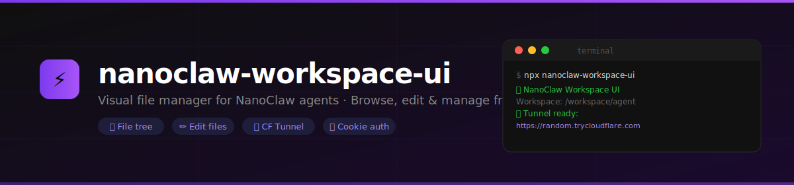

<p align="center">
  
</p>

<p align="center">
  <a href="https://www.npmjs.com/package/nanoclaw-workspace-ui"></a>
  = 18" />
  
  
  
</p>

<p align="center">
  A browser-based file manager for <a href="https://github.com/nanocoai/nanoclaw">NanoClaw</a> agent workspaces.<br/>
  Browse, edit, and manage your agent's files — from your laptop, phone, or anywhere.
</p>

---

## What is this?

When a [NanoClaw](https://github.com/nanocoai/nanoclaw) agent runs, it lives in a container with a `/workspace/agent/` directory — scripts, config files, memory, logs, everything. **nanoclaw-workspace-ui** gives you a visual window into that workspace through your browser, with no SSH or CLI needed.

Start it with one command. It serves a file manager on a local port, and if you're on a remote server, it automatically creates a **free Cloudflare tunnel** so you can access it from anywhere.

---

## Quick Start

```bash
npx nanoclaw-workspace-ui
```

The server starts, prints a URL, and you're in.

---

## Two scenarios

### Scenario 1 — NanoClaw running locally (on your own machine)

This is the case where NanoClaw runs in Docker on your laptop or desktop. The workspace is accessible from your machine.

**Steps:**

1. **Find the workspace path on your host machine** — this is different from the path inside Docker.

   The agent workspace lives in the NanoClaw data folder, typically under `groups/<your-group-name>/`. Not sure of the full path? Open a terminal, navigate to the folder you see in VS Code or Finder, and run:
   ```bash
   pwd
   # example output: /Users/yourname/nanoclaw-v2/groups/dm-with-ido-navarro
   ```
   > **Important:** Inside the Docker container the workspace path is `/workspace/agent`. But when running the UI on your host machine, you need the *host* path — the one `pwd` gives you.

2. Start the UI with that path:

   ```bash
   npx nanoclaw-workspace-ui --workspace /Users/yourname/nanoclaw-v2/groups/dm-with-ido-navarro --port 3100 --no-tunnel
   ```

3. The server starts and prints:

   ```
   🚀 NanoClaw Workspace UI
      Workspace: /Users/yourname/nanoclaw-v2/groups/dm-with-ido-navarro
      URL:       http://localhost:3100?token=abc123xyz
   ```

4. Open `http://localhost:3100?token=abc123xyz` in your browser. The token is exchanged for a session cookie on first visit — the URL becomes clean and the token is gone from the address bar.

> **Tip:** Pass `--no-tunnel` when running locally — there's no need for a Cloudflare tunnel if you're on the same machine.

---

### Scenario 2 — NanoClaw running on a remote VM / cloud server

This is the case where your agent runs on a VPS, AWS EC2, Hetzner, or any remote machine. You can't access `localhost` from your browser — you need a public URL.

**Steps:**

1. **Install cloudflared** on the server (one-time, free, no Cloudflare account needed):

   ```bash
   npm install -g cloudflared
   # or: npx cloudflared --version  (to check if it's already there)
   ```

2. **Start the UI** (no extra config needed — the tunnel starts automatically):

   ```bash
   npx nanoclaw-workspace-ui --workspace /workspace/agent
   ```

3. Wait a few seconds. The server prints a public URL:

   ```
   🌐 Starting Cloudflare tunnel...
   
   ✅ Tunnel ready: https://random-words-here.trycloudflare.com?token=abc123xyz
   ```

4. Open that URL in **any browser, from anywhere** — your laptop, phone, tablet.

5. The token is exchanged for a session cookie on first visit. The URL becomes clean (`https://random-words-here.trycloudflare.com`). Session lasts 8 hours.

> **About the tunnel URL:**  
> Cloudflare Quick Tunnels generate a new random URL each restart. The URL is only valid while the server is running. For a stable, permanent URL you can reuse, see [Named Tunnels](#stable-urls-named-tunnels).

---

## How the authentication works

Security was designed so the token is never stored in browser history.

```
1. You open:  https://your-tunnel.trycloudflare.com?token=abc123
                                                      ↑ one-time
2. Browser redirects to:  /auth?token=abc123
3. Server validates token → creates a session → sets an HttpOnly cookie
4. Browser is redirected to:  /
                               ↑ clean URL, no token visible
5. All subsequent API calls use the cookie automatically
```

**Brute-force protection:** 10 failed attempts from the same IP triggers a 15-minute lockout.

**Cookie details:** `HttpOnly` (not readable by JavaScript), `SameSite=Strict`, `Max-Age=28800` (8 hours).

---

## Options

| Flag | Default | Description |
|------|---------|-------------|
| `--workspace` | `/workspace/agent` | Directory to expose in the UI |
| `--port` | `3100` | Local HTTP port to listen on |
| `--token` | *(random)* | Auth token — printed on startup if not set |
| `--no-tunnel` | — | Skip starting the Cloudflare tunnel |

**Environment variables** (alternative to flags):

| Variable | Description |
|----------|-------------|
| `NANOCLAW_WORKSPACE` | Workspace path |
| `PORT` | HTTP port |
| `UI_TOKEN` | Fixed token — useful for keeping the same URL across restarts |

---

## Let your agent send you the link

The real power comes from integrating this with your NanoClaw agent. The agent can start the UI itself and send you the tunnel link through chat — you never have to SSH in.

Add this script to your workspace:

```js
// workspace_ui.mjs
import { spawn } from 'child_process';
import { writeFileSync, existsSync, readFileSync } from 'fs';

const PID_FILE = '/tmp/workspace-ui.pid';
const URL_FILE = '/tmp/workspace-ui.url';

// Check if already running
if (existsSync(PID_FILE)) {
  try {
    process.kill(parseInt(readFileSync(PID_FILE, 'utf8')), 0);
    console.log('Already running:', readFileSync(URL_FILE, 'utf8').trim());
    process.exit(0);
  } catch {}
}

const child = spawn('npx', [
  'nanoclaw-workspace-ui',
  '--workspace', '/workspace/agent',
  '--port', '3100',
], { detached: true, stdio: ['ignore', 'pipe', 'pipe'] });

writeFileSync(PID_FILE, String(child.pid));
child.unref();

const onData = (data) => {
  const match = data.toString().match(/https:\/\/[a-z0-9-]+\.trycloudflare\.com\?token=[^\s]+/);
  if (match) {
    writeFileSync(URL_FILE, match[0]);
    console.log('TUNNEL_URL:' + match[0]); // agent picks this up and sends to chat
    process.exit(0);
  }
};

child.stdout.on('data', onData);
child.stderr.on('data', onData);
setTimeout(() => { console.log('Timeout.'); process.exit(1); }, 30000);
```

Then just say to your agent: *"Open the workspace UI"* — it runs the script, reads the URL from stdout, and sends it to you in chat.

---

## Stable URLs — Named Tunnels

Cloudflare Quick Tunnels (the default) give a different URL every time. If you want the same URL across restarts:

1. [Create a free Cloudflare account](https://cloudflare.com)
2. [Add your domain to Cloudflare](https://developers.cloudflare.com/fundamentals/setup/manage-domains/add-site/)
3. Create a named tunnel:
   ```bash
   cloudflared tunnel create my-agent
   cloudflared tunnel route dns my-agent workspace.yourdomain.com
   cloudflared tunnel run --url http://localhost:3100 my-agent
   ```

Your workspace will always be at `https://workspace.yourdomain.com`.

---

## Features

- **File tree** — navigate directories, expand/collapse
- **Editor** — edit any text file with syntax highlighting (code, markdown, JSON, YAML, shell scripts)
- **Image preview** — view PNG, JPG, GIF, WebP, SVG
- **Create** — new files and folders
- **Delete** — with confirmation
- **Save** — Ctrl+S / Cmd+S
- **Zero build step** — single-file frontend, works out of the box
- **Cookie auth** — token-in-URL only on first visit, then clean URLs
- **Rate limiting** — brute-force protection built in

---

## Part of the NanoClaw ecosystem

This package is part of the [NanoClaw](https://github.com/nanocoai/nanoclaw) agent platform.

| Package | Description |
|---------|-------------|
| [nanoclaw](https://github.com/nanocoai/nanoclaw) | Core agent platform |
| **nanoclaw-workspace-ui** | Visual workspace file manager (this package) |

---

## License

MIT
